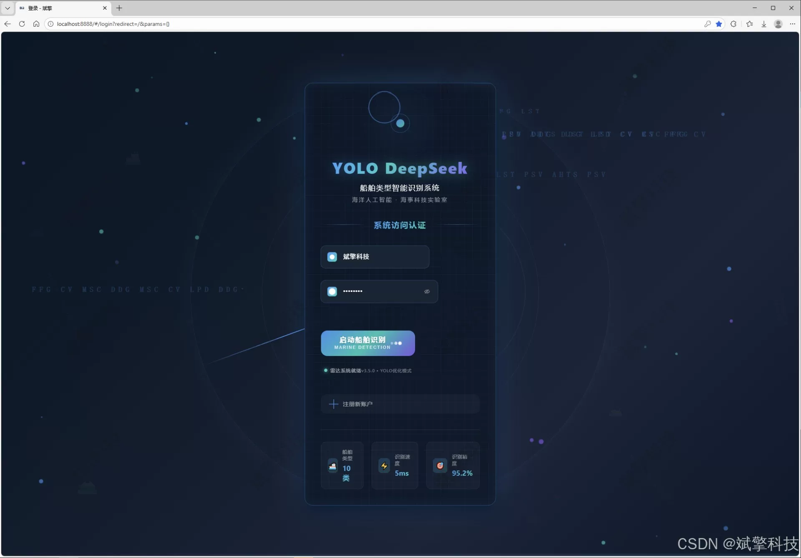
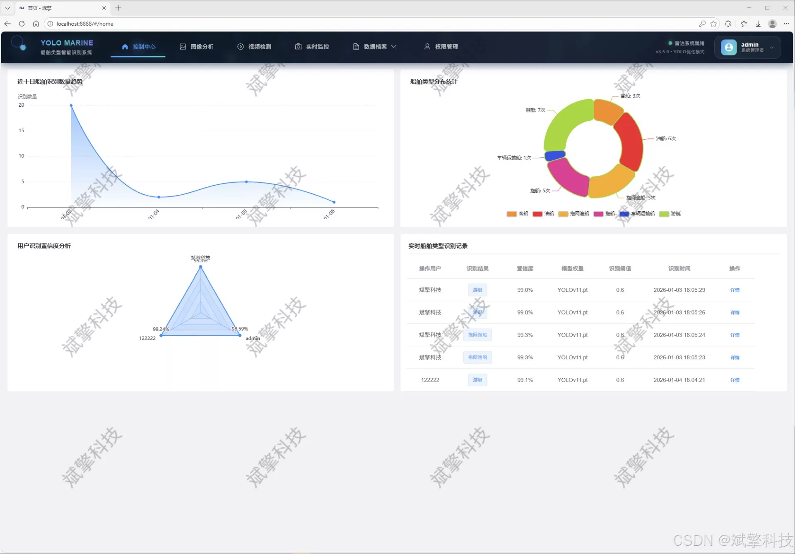
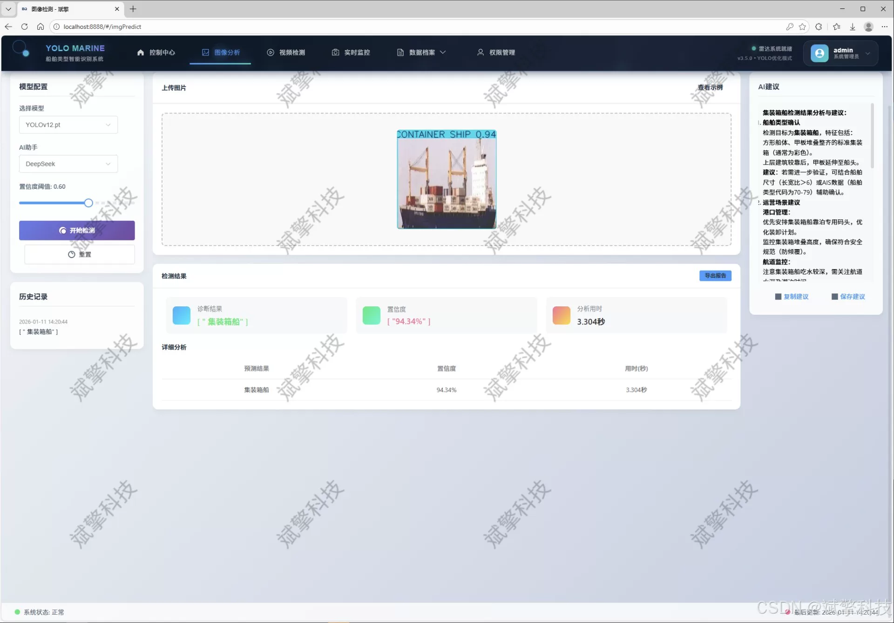
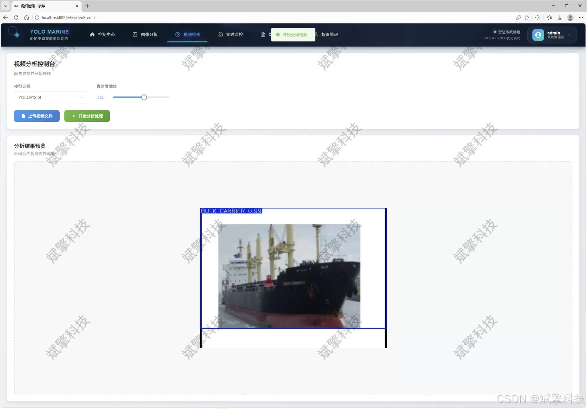
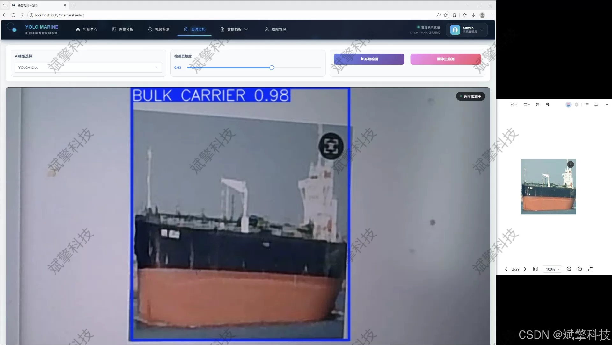
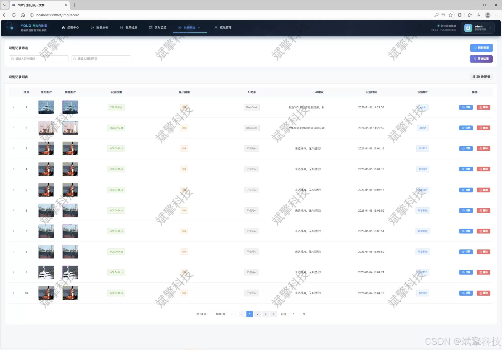
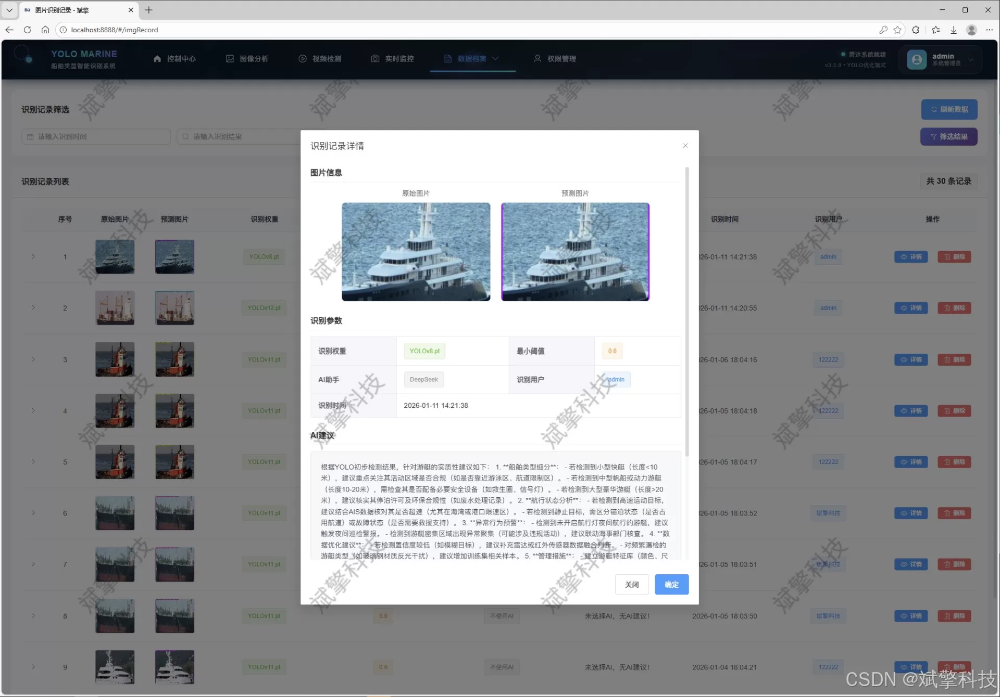
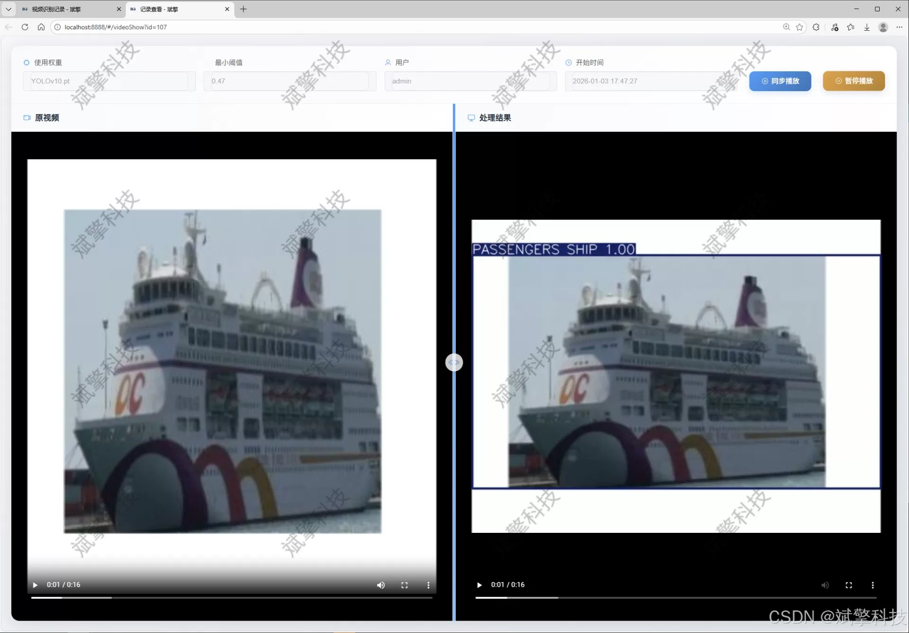
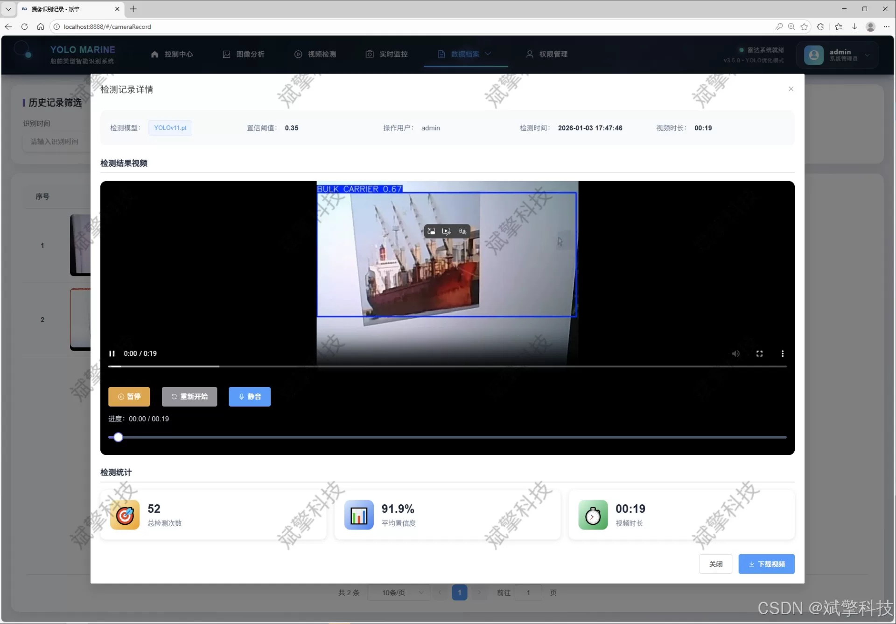

# Based on YOLO deep learning and the large models of Qianwen and DeepSeek, the types of ships

## Body

Based on YOLO deep learning and the large models of Qianwen, DeepSeek intelligent analysis system for ship type identification detection (DeepSeek intelligent analysis + web interaction interface + front-end separation + YOLO data + YOLOv8/YOLOv10/YOLOv11/YOLOv12)

This project has been designed and implemented a smart identification and management system for ship types based on deep learning. The system adopts a front-end separation architecture, with the backend based on the SpringBoot framework, and the front end provides a modern web interaction interface, and uses MySQL database for data persistence management. In terms of core detection algorithms, the system innovatively integrates and compares the current most advanced YOLO series object detection models (including YOLOv8, YOLOv10, YOLOv11, and YOLOv12), and has constructed a large-scale specialized dataset covering 10 common ship types in marine scenarios (such as bulk carriers, container ships, oil tankers, tugs, yachts, etc.).

The system deeply integrates the DeepSeek large language model to provide intelligent marine scene analysis, ship feature description, and potential risk assessment for detection results. Moreover, the system includes complete user permission management, detection record traceability, multi-dimensional data visualization, and an administrator's back-end module. Experimental results show that this system can efficiently and accurately complete complex marine environment multi-object ship recognition tasks, providing a powerful and scalable intelligent decision support platform for port intelligent management, channel monitoring, maritime traffic services, fishery supervision, and other application scenarios.

Functional modules

✅ User login registration: Support password verification, saved to MySQL database.

✅ Support four YOLO models switching, YOLOv8, YOLOv10, YOLOv11, YOLOv12.

✅ Information visualization, data visualization.

✅ Image detection support AI analysis function, DeepSeek and Qianwen.

✅ Support image detection, video detection, and real-time camera detection, detection results saved to MySQL database.

✅ Image recognition record management, video recognition record management, and camera recognition record management.

✅ User management module, administrator can add, delete, update, and view users.

✅ Personal center, can modify personal information, password name profile picture and so on.

## Images

## Payment

Here is a pay link on Stripe ( https://buy.stripe.com/3cs8yP7sY87d0vu9AB ). Please contact me lonlonago@foxmail.com after funding $89, and I will send you a complete data files , thank you!

